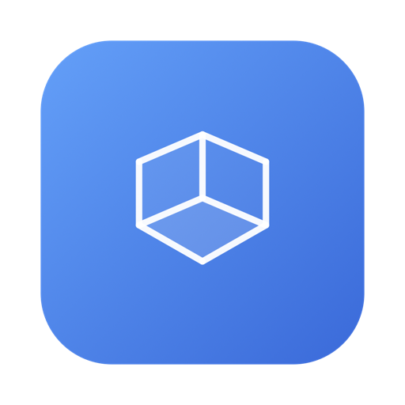
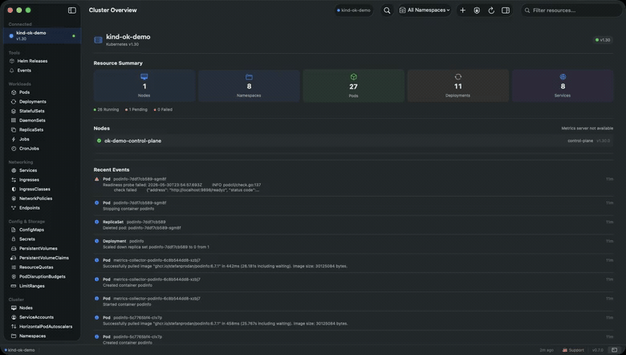

<div align="center">



# OptaKube

**A fast, native macOS Kubernetes client.**
Browse, inspect, and operate your clusters from a real Mac app — built in Swift, not Electron.

[](https://www.apple.com/macos/)
[](https://swift.org)
[](LICENSE)
[](https://github.com/souriscloud/optakube/releases)

[**Download for macOS**](https://github.com/souriscloud/optakube/releases/latest) · [Website](https://apps.souris.cloud/apps/optakube) · [Changelog](CHANGELOG.md)

</div>

---

OptaKube talks to the Kubernetes API directly over `URLSession` — no bundled `kubectl` proxy, no third-party HTTP stack, no web views. It opens instantly, sips memory, and feels like the Mac app it is.



*Live updates over the Watch API — pods appear and drain in real time, no refresh button.*

## Features

**Multi-cluster, by design**
- A window per cluster, each with independent namespace, view, and state (JetBrains-style: a welcome hub, then a window per session)
- Live updates over the Watch API across every connected cluster at once — bursts are coalesced so a 200-pod rollout stays smooth

**See everything**
- 20+ built-in resource types — Pods, Deployments, Services, Nodes, StatefulSets, DaemonSets, ReplicaSets, Jobs, CronJobs, ConfigMaps, Secrets, Ingresses, IngressClasses, PVs, PVCs, NetworkPolicies, ServiceAccounts, HPAs, Namespaces, Endpoints
- **CRD auto-discovery** — browse any Custom Resource Definition installed on the cluster
- Inline CPU/memory bars in tables, per-container charts, and a cluster overview dashboard
- Detail views with container tabs, probes, env vars, volume mounts; reveal Secret/ConfigMap values inline
- Live **events** per resource, with a warning badge so failures surface without clicking in

**Operate**
- Restart, scale, and **roll back** deployments — with a side-by-side revision diff before you commit
- Port forwarding, debug/ephemeral containers, CronJob trigger/suspend/resume, node cordon/drain, pod eviction
- **Exec into a pod's shell** straight from the context menu

**Live in it**
- Multi-pod **log streaming** — chronological, searchable, JSON/logfmt colour-coded, exportable
- An embedded **terminal** (real PTY: fish, zsh, bash) that inherits your kubeconfig and context
- **Spotlight search** (⌘K) across every resource, namespace, type, and CRD

**Connects to anything**
- Auth: bearer tokens, client certificates (EC + RSA), and exec-based (AWS EKS, GCP GKE) via your login shell
- Pins your cluster's CA exactly like kubectl, so self-hosted clusters with private CAs just work
- Auto-updates via Sparkle (signed & notarized)

## Install

Download the latest signed, notarized DMG from the [**Releases**](https://github.com/souriscloud/optakube/releases/latest) page.

Or build from source:

```bash
git clone https://github.com/souriscloud/optakube.git
cd optakube
swift build -c release
open .build/release/OptaKube
```

## Requirements

- macOS 14 (Sonoma) or later
- A kubeconfig (the one `kubectl` already uses)
- `kubectl` on `PATH` (used for port forwarding and pod exec)

## Keyboard shortcuts

| Shortcut | Action |
|----------|--------|
| ⌘K | Spotlight search |
| ⌘D | Toggle detail panel |
| ⌘R | Refresh |
| ⌘⇧T | Toggle terminal |
| ⌘1–9 | Switch resource type |

## Architecture

- **SwiftUI** + **@Observable** for reactive UI (no Combine)
- **URLSession** for the K8s API — no third-party HTTP libraries
- **Security.framework** + **openssl** for TLS client certificates and custom CA trust
- **SwiftTerm** for the embedded terminal
- **Yams** for kubeconfig parsing
- **Swift Charts** for metrics, **Sparkle** for auto-updates

## Made by

[Souris.CLOUD](https://bio.souris.cloud) — more apps at [apps.souris.cloud](https://apps.souris.cloud).

If you find OptaKube useful, consider [supporting on Ko-fi](https://ko-fi.com/souriscloud).

## License

[MIT](LICENSE)
